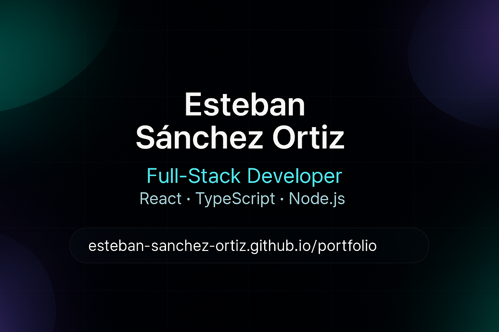

# Portfolio — Esteban Sánchez Ortiz

A modern, responsive developer portfolio built with **Vite**, **React**, **TypeScript**, **Tailwind CSS**, and **Framer Motion**.  
This site showcases my professional experience, selected work, technical skills, and personal brand.

 <!-- Replace with actual screenshot path -->

## ✨ Features

- **Responsive Design** — Optimized for both desktop and mobile devices.  
- **Smooth Animations** — Powered by Framer Motion for fluid transitions and parallax effects.  
- **Clean UI** — Minimalist, dark-themed layout with elegant typography and consistent spacing.  
- **Performance Optimized** — Built with Vite for lightning-fast builds and hot-reload.  
- **Reusable Components** — Modular and scalable architecture.  

## 📂 Project Structure

```
src/
  ├── components/    # Reusable UI components
  ├── sections/      # Site sections
  │   ├── Banner/
  │   ├── Hero/
  │   ├── WorkExperience/
  │   ├── Projects/
  │   ├── Background/
  │   ├── Speech/
  │   ├── Education/
  │   ├── CTA/
  │   └── Footer/
  ├── assets/        # Static assets (images, icons)
  ├── hooks/         # Custom React hooks
  └── main.tsx       # App entry point
```

## 🛠️ Tech Stack

- **React** — UI library  
- **TypeScript** — Static typing  
- **Vite** — Build tool  
- **Tailwind CSS** — Utility-first CSS framework  
- **Framer Motion** — Animations and transitions  
- **Tech Icons** — For representing skills and technologies

## 🚀 Getting Started

### 1️⃣ Clone the repository
```bash
git clone https://github.com/esteban-sanchez-ortiz/portfolio.git
cd portfolio
```

### 2️⃣ Install dependencies
```bash
npm install
```

### 3️⃣ Start development server
```bash
npm run dev
```

### 4️⃣ Build for production
```bash
npm run build
```

## 📄 License
This project is licensed under the MIT License — see the [LICENSE](./LICENSE) file for details.


## Idiomas, HTML estático y pruebas

`npm run build` genera diez rutas HTML en `/portfolio/en/` y `/portfolio/es/`, con canonical propio, hreflang recíproco y sitemap. Las cinco entradas antiguas redirigen a inglés. El navegador hidrata el HTML. No se necesita fallback SPA para estas rutas. No cambiamos preferencias de bots.

`npm run lint`, `npm run build` y `node --test tests/chat.test.mjs` verifican código y streaming. Las pruebas automatizadas simulan proveedores; las conversaciones reales se prueban exclusivamente con el backend local.

La preview local nunca llama automáticamente al Worker público: utiliza `http://localhost:8787`. En `worker`, copiar `.dev.vars.example` a `.dev.vars` e introducir claves directamente en el editor; no compartirlas por chat. Ejecutar `npm ci`, luego `npm run dev:local`. KV y rate limiter son locales y no modifican producción. No usar `--remote` para pruebas. Fireworks es el proveedor principal; Groq conserva guard y respaldo.

GitHub Actions actual publica el frontend en Pages después de push a main. El Worker tiene despliegue separado documentado en `worker/README.md`; este cambio no crea un pipeline alternativo. Las pruebas funcionales se hacen antes de publicar. La verificación posterior solo revisa artefactos/versiones y HTTP estático.

Contenido pendiente de confirmar: títulos/fechas educativas, empleos recientes y métricas del CV. No se publican esas métricas ni se atribuyen ventas a Amparo.

El flujo CI/CD y la configuración manual mínima están documentados en [docs/deployment.md](docs/deployment.md).
